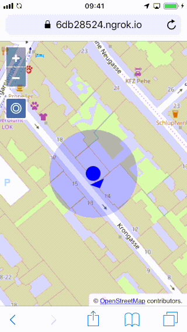

# Add heading and make thing look nice

Most mobile devices are equipped with a gyroscope, which we are going to use as a compass to show our heading on the map.

Under the hood, the browser can access the gyroscope through the `deviceorientation` event. Listeners receive readings for the three axes of the device. Fortunately, we do not have to do the math ourselves. Instead, we can take advantage of the [kompas](https://npmjs.com/package/kompas/) package, and get the heading directly.

We want give the location point an icon with an arrow that shows the heading.

First, we import the OpenLayers style modules we're going to use to make the location and heading indicators look nice:

[import:'import-style'](../../../src/en/examples/mobile/compass.js)

Now we can create the style and assign it to the layer. While we're at it, we not only create a nice icon with arrow for the location and heading, but also make the accuracy polygon look nicer:

[import:'style'](../../../src/en/examples/mobile/compass.js)

The style contains a fill, which is used for the accuracy polygon. For the location point, we use a `svg` file that is already in the `data/` directory of the workshop materials. The `rotateWithView` option tells OpenLayers to not keep the icon upright, but rotate it with the view to preserve the heading. For now, the icon does not have a `rotation` set, so the arrow will point upwards.

Next, we install and import the `kompas` utility. *Note*: Skip this step when you using the original workshop setup, where this has been done already. Installation is done on the terminal with

    npm install kompas

The import line is added at the top of `main.js` as usual:

[import:'import-kompas'](../../../src/en/examples/mobile/compass.js)

The final thing to do is get the heading from the `Kompas` utility, and set it as rotation on the icon:

[import:'kompas'](../../../src/en/examples/mobile/compass.js)

The final navigation tool with a user looking for orientation should now act like this:

