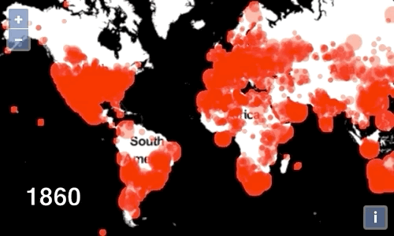
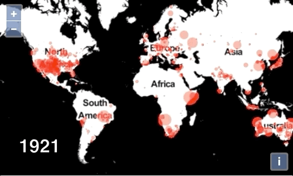

# Animating meteorite impacts

So far we have managed to get data from our CSV file rendered with WebGL, but the map is pretty uninteresting.  We're using the mass of the meteorite to determine the radius of the circle, but we're not making use of the meteorite impact date that we parsed as the `year` property in our point features.

The `year` property for our meteorite features have values that range from 1850 to 2015.  We'll set up an animation loop that increments the current year, render meteorites on their impact year, and then decrease their size as time passes.

As a first step, we'll get the animation loop going and render the current year to a `
` on top of the map.  Add the following markup below the map container in your `index.html`:

[import:'markup'](../../../src/en/examples/webgl/animated.html)

Edit the `<style>` block to include the following rule:

[import:'style', lang:'css'](../../../src/en/examples/webgl/animated.html)

Now we'll declare some variables to represent the time range of the data and the rate at which we want the animation to proceed.  Add the following code above your custom layer class in `main.js`:

[import:'years'](../../../src/en/examples/webgl/animated.js)

Next we need to assign our map instance to a `map` variable that we can reference later:

[import:'declaration'](../../../src/en/examples/webgl/animated.js)

Below the map configuration, add the following `render` function to get the animation loop started.

[import:'animate'](../../../src/en/examples/webgl/animated.js)

If you got it all right, you should see the years rolling by in the lower left corner above the map.

Now, let's get to the harder part. Previously we used a WebGL Points Layer to display our data, and using some clever expressions we were able to give the points a dynamic styling. But what if we want to animate the points? This is where we reach the limit of what the `WebGLPointsLayer` class has to offer.

To achieve an animation effect we must *write custom fragment and vertex shaders*. Shaders are low-level programs that are compiled and run on the GPU, and written in GLSL language. If you're interested in learning more about shaders and WebGL, take a look at [The Book of Shaders](https://thebookofshaders.com/).

First, let's import the renderer that we will use instead of the `WebGLPointsLayer` class:

[import:'renderer'](../../../src/en/examples/webgl/animated.js)

And then create a custom layer type using this renderer:

[import:'customlayer'](../../../src/en/examples/webgl/animated.js)

Next, we will have to provide options to the renderer.

**Uniforms** are values that do *not* vary from feature to feature. They are a bit like constants, although their value can be changed at each frame. The options to the WebGL point layer renderer accepts a `uniforms` object where we can supply either fixed values or functions to compute the value at runtime.

Add the following object to the renderer options.

[import:'uniforms'](../../../src/en/examples/webgl/animated.js)

**Attributes** will be different for each feature. They are described both by a `name` and a `callback` with the current feature as argument. The WebGL renderer takes an `attributes` array with these.

Since we want to take into account both the `mass` and `year` of the meteorite impacts, let's define two attributes accordingly: 

[import:'attributes'](../../../src/en/examples/webgl/animated.js)

Finally, we will define two **shaders** (fragment and vertex) which will use the above mentioned attributes and uniforms. Shaders are technically code but they must be passed on as strings to be executed by the GPU. Provide these using `fragmentShader` and `vertexShader` properties to the renderer:

[import:'shaders'](../../../src/en/examples/webgl/animated.js)

We won't dive too much into the vertex shader. Its role is mainly to set the size of the points, and pass on the `year` to the fragment shader.

> For now, the renderer still requires you to give it a full working shader although most of it is reusable from other use cases. This might evolve with upcoming releases of OpenLayers.

Let's take a closer look at the fragment shader:

[import:'fragment'](../../../src/en/examples/webgl/animated.js)

The `main` block begins with this condition:

[import:'discard'](../../../src/en/examples/webgl/animated.js)

This means the point will simply not be rendered if its impact year is higher than the current one. We're essentially filtering features on the GPU. Easy enough, right?

Then, this part uses the [`smoothstep` function](https://thebookofshaders.com/glossary/?search=smoothstep) to turn what was a square into a circle. Fiddle with the values passed to `smoothstep` to see if you can get a feel for how it works.

[import:'alpha'](../../../src/en/examples/webgl/animated.js)

With all the renderer options in place, you should now be able to see meteor impact sites appearing and then decreasing in size as time passes.

Congratulations!

Some additional notes about shaders:

* Both shaders have definitions at their beginning; you probably recognized the uniforms and attributes we specified earlier, but the shaders also include uniforms and attributes that are provided by default by the renderer, such as the matrices uniforms and the `vec2 a_position` vector which holds the point coordinates;

* To pass on data from the vertex shader to the fragment shader, we use the `varying` type; a `varying` must be declared in both shader, and its value assigned in the vertex shader will be accessible in the fragment shader.

* To learn more about these concepts, take a look at the following explanations of [attribute](https://thebookofshaders.com/glossary/?search=attribute), [varying](https://thebookofshaders.com/glossary/?search=varying) and [uniform](https://thebookofshaders.com/glossary/?search=uniform)
