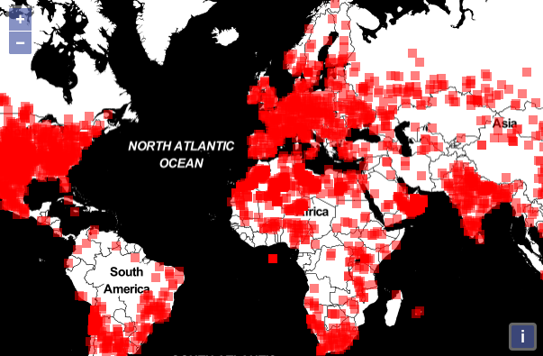
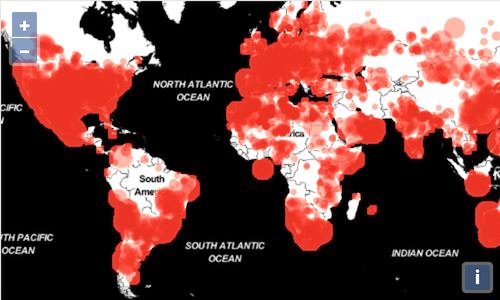

# Rendering points with WebGL

In the previous step, we rendered point features with the normal vector layer.  This layer uses the 2D canvas context for rendering.  With this layer, you can render tens of thousands of points – as long as you are careful about writing efficient styling code.  For rendering larger numbers of points, or to do more efficient dynamic styling, WebGL is a good solution.  OpenLayers has a growing set of utilities for rendering with WebGL.  WebGL rendering is currently limited to points, and that is what we'll do in this exercise.

First, we'll import the constructor of the WebGL-enabled points layer. This layer is an easy-to-use entry point for leveraging the advantages of the WebGL technology.

[import:'imports'](../../../src/en/examples/webgl/squares.js)

In the `layers` array for your map, replace the `VectorLayer` with an instance of your `WebGLPointsLayer` using the same vector source as before.

[import:'layer'](../../../src/en/examples/webgl/squares.js)

Tada! Meteorite impact locations rendered with WebGL.

You can see that we specified a `style` parameter when creating the layer, and that this style allowed us to specify the appearance of the points (red squares).

Changing the style of a WebGL layer is quite different from the rest of the library. Instead of using the `Fill`, `Stroke` and `Image` classes like other vector layers, we simply have to provide an object with the style parameters. The supported properties for this object are pretty straightforward: `opacity`, `color`, `size`, `offset`, `src` (for images) and `symbolType` (which can be `circle`, `square`, `triangle` or `image`).

> WebGL layers use a completely different rendering system, and the style object is actually transformed dynamically into fragment and vertex shaders. 

By navigating in the map you might already notice a performance improvement from the previous step where we were using a standard Canvas 2D layer.

Now, I think we can all agree on the fact that this map isn't great to look at: that is probably because *each and every point* has the same styling.

Let's begin by asking for circles instead of squares:

[import:'layer'](../../../src/en/examples/webgl/circles.js)

This is where things are getting interesting. Not only did we specify that we wanted the points to be rendered as circles, we also specified that the bigger the meteorite was, the bigger the circle should be.

The dynamic size expression uses an experimental API that is part of version 6 of OpenLayers and is subject to change. Nonetheless, let's look at it in details:

[import:'expression'](../../../src/en/examples/webgl/circles.js)

The `WebGLPointsLayer` class supports this kind of expression for the numerical attributes of its style (size, opacity, color components, etc.).

An expression is composed of **operators** that are expressed as *arrays* like so:

[import:'operator1'](../../../src/en/examples/webgl/circles.js)
[import:'operator2'](../../../src/en/examples/webgl/circles.js)
[import:'operator3'](../../../src/en/examples/webgl/circles.js)

The first operator, `get`, will read the feature's attribute by its name. The other operators, here showcased `clamp` and `*`, allow manipulating the output of another operator. In the previous example we used these to transform the meteorites mass values into a final size comprised between 8 and 26.

Looking better and better!

